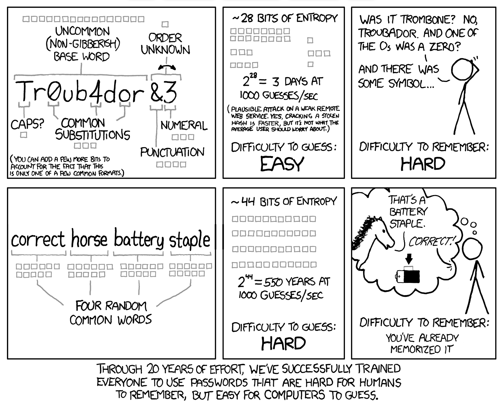
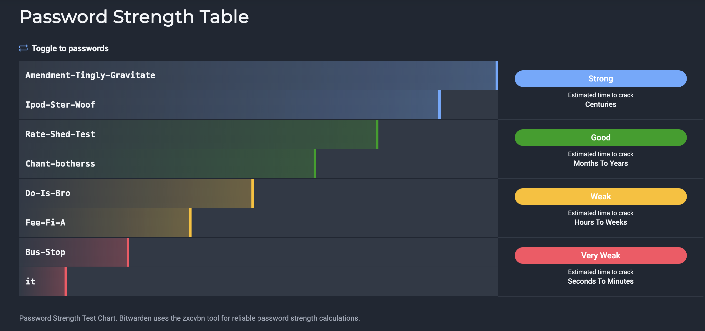
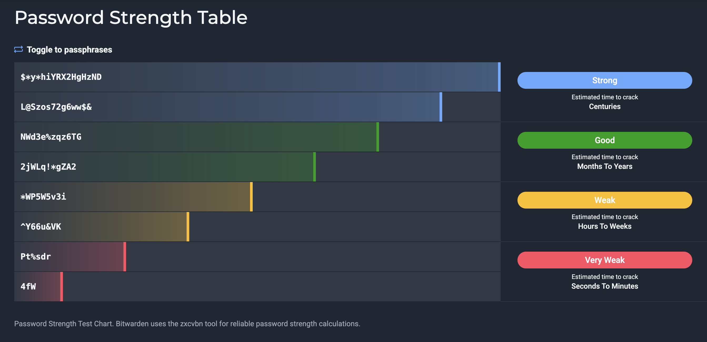

<!-- _class: lead -->

# Hogyan legyünk biztonságban online

## 🔐 Bitcoin vásárlás biztonságosan

---
## Mitől védekezünk?
**threat modelling / fenyegetésmodellezés**

### 🎭 Fő veszélyek

🎣 **Phishing** (adatok kicsalása)
🦠 **Malware** (rosszindulatú szoftverek)
🔨 **Fizikai támadás** ($5 wrench attack)

💥 **Tőzsde csődök**
🆔 **adatszivárgás** (KYC, marketing adatbázisok)
📱 **Közösségi média** (social engineering)

---

### 💥 Tőzsde csődök

| Esemény | Év | Veszteség |
|---------|-----|-----------|
| **Mt. Gox** | 2014 | 850,000 BTC |
| **FTX** | 2022 | USD milliárdok |
| **Celsius** | 2022 | Csőd |

### ⚠️ "Nem a te kulcsod, nem a te coinod."

---

### 🆔 KYC Veszélyei

💥 **Adatbázis feltörések** (Ledger 2020)
🎯 **Célzott fizikai támadások**
👁️ **Teljes privacy elvesztése**
📊 **Adatbrókerek, kormány, adóhatóság**

---

<!-- _class: lead -->

## 🛡️ Operational Security 
**(OpSec / Működési Biztonság)**

---

### 🤐 ~~Arany~~ ₿itcoin szabály

**Ne mondd el senkinek,**
**mennyi Bitcoinod van!**

### "Hallgatni ~~arany~~ Bitcoin!"

---

### 🚫 Mit NE tegyél

📱 Ne posztolj **Bitcoin vásárlásról**
💰 Ne mondd el, **mennyi van**
📍 Ne mondd el, **hol tárolod**
🖼️ Ne használj **Bitcoin profilképet**
🎁 Ne kattints **giveaway-ekre** (SCAM!)
👕 Ne hordj magadon **Bitcoin logókat**

---

<!-- _class: lead -->

## 🔧 Ajánlott Eszközök

---

### 🌐 Böngészők - Asztali gépen és Mobilon

### 🦁 Brave

✅ Beépített adblocker
✅ Tor integráció
✅ Fingerprinting védelem

### 🦊 Firefox

✅ Nyílt forráskódú
✅ uBlock Origin
✅ Container tabs

### 🧅 Tor Browser

✅ Lassabb, de megbízhatóan elrejti az IP címedet
✅ .onion domaineket támogat

---

### 🛡️ Adblocker

**uBlock Origin** (Firefox, Chrome)

✅ Blokkolja a **hirdetéseket**
✅ Blokkolja a **trackereket**
✅ Blokkolja a **malware** oldalakat
✅ **Nyílt forráskódú**

**Telepítsd:** https://ublockorigin.com

---

### 🔐 Jelszókezelő: Bitwarden

✅ **Nyílt forráskódú**
✅ **Végponti (end-to-end) titkosítás**
✅ **Ingyenes verzió**
✅ **Jelszó / jelmondat generátor** (20+ karakter)
✅ **Több eszközön szinkronizál**
✅ **Self-hosted opció**

**https://bitwarden.com**

---

### 🔑 Jelszó biztonság

✅ **Egyedi jelszó** minden fiókhoz
✅ **20+ karakter**, vegyes karakterek vagy **4 szavas jelmondat**
✅ **Bitwarden** generálja
❌ **SOHA ne használd újra** a jelszavakat

**Példa erős jelszó:**
`K9#mP2$vL8@nQ5!xR7&wT3`

**Példa passphrase:**
 `correct horse battery staple`

---

---

---

---

### 🔐 Kétfaktoros Hitelesítés / Autentikáció (2FA)

**TOTP (Time-based One-Time Password)**

✅ **Aegis Authenticator** (Android, nyílt forráskódú)
✅ **2FAS OTP** (iOS + Android)

❌ **SOHA ne SMS 2FA** (SIM swap támadás!)

---

### 📧 Email Aliasok

### 🦆 DuckDuckGo

✅ Ingyenes
✅ Spam szűrés
✅ Tracker eltávolítás

**duckduckgo.com/email**

### 📧 SimpleLogin

✅ Korlátlan aliasok
✅ Egyéni domain
✅ Nyílt forráskódú

**simplelogin.io**

---

### 📧 Miért email alias?

🎭 **Valódi email cím rejtése**
💾 Ha a tőzsde **adatbázisa szivárog**, nem a valódi email-ed
🗑️ **Könnyű leiratkozás** (alias törlése)
🚫 **Spam csökkentés**

**Példa:**
`kraken-2024@duck.com` → `felhasznalonev@gmail.com`

---

### 🔒 VPN

**Miért fontos Bitcoin vásárlásnál?**

🌐 **IP cím elrejtése**
📍 **Földrajzi hely elrejtése**
🔒 **ISP nem látja**, hogy Bitcoin tőzsdét használsz
📶 **Védelem nyilvános WiFi-n**

---

### 🔒 Ajánlott VPN-ek

| VPN | Jellemzők | Weboldal |
|-----|-----------|--------|
| **Mullvad** | Bitcoin Lightning fizetés, no-log | mullvad.net |
| **IVPN** | Bitcoin Lightning fizetés, no-log | ivpn.net |

⚠️ **Az Ingyenes VPN-ek NEM biztonságosak!**

---

<!-- _class: lead -->

## ✅ ₿itcoin Vásárlás Biztonsági Lista

---

### 🔐 Vásárlás ELŐTT

1. ✅ **Brave/Firefox** telepítése
2. ✅ **uBlock Origin** telepítése
3. ✅ **Bitwarden** beállítása
4. ✅ **Email alias** létrehozása
5. ✅ **VPN** előfizetés
6. ✅ **TOTP app** telepítése (Aegis/2FAS)

---

### 💰 Vásárlás KÖZBEN

1. ✅ **VPN bekapcsolása**
2. ✅ **Tőzsde URL ellenőrzése** (phishing!)
3. ✅ **Email alias** használata regisztrációhoz
4. ✅ **Erős jelszó** (Bitwarden generálja)
5. ✅ **2FA bekapcsolása** (TOTP)
6. ✅ **KYC minimalizálása**

---

### 🔒 Vásárlás UTÁN

⚡ **AZONNAL vidd ki a Bitcoin-t saját wallet-be!**

❌ **Ne tárolj Bitcoin-t a tőzsdén!**

### "Nem a te kulcsod, nem a te coinod."

---

### 🛡️ Hosszú távú biztonság

1. ✅ **Ne mondd el**, mennyi Bitcoin-od van
2. ✅ **Ne posztolj** róla közösségi médiában
3. ✅ **Rendszeres szoftver frissítések**
4. ✅ **Jelszavak cseréje** (ha adatszivárgás)
5. ✅ **2FA backup kódok** biztonságos helyen

---

### 🔑 5 ₿itcoin Szabály

1. **"Nem a te kulcsod, nem a te coinod."**
2. **"Ne bízz, ellenőrizz."**
3. **"Hallgatni arany."**
4. **Egyedi jelszó + 2FA mindenhez**
5. **Email alias mindenhol**

---

### ⚠️ SOHA ne tedd

❌ Bitcoin tárolása tőzsdén
❌ SMS 2FA
❌ Jelszó újrahasználat
❌ Nyilvános WiFi VPN nélkül

❌ Giveaway-ekre kattintás
❌ Bitcoin birtoklás megosztása
❌ Saját névhez kötött email használata
❌ Gyenge jelszavak

---

**Böngészők:**
- Brave: https://brave.com
- Firefox: https://mozilla.org/firefox

**Eszközök:**
- Bitwarden: https://bitwarden.com
- uBlock Origin: https://ublockorigin.com
- DuckDuckGo Email: https://duckduckgo.com/email
- SimpleLogin: https://simplelogin.io

**VPN:**
- Mullvad: https://mullvad.net
- IVPN: https://ivpn.ne

---

<!-- _class: lead -->

# Köszönöm a figyelmet!

## Kérdések?

**huszonegy.world**
